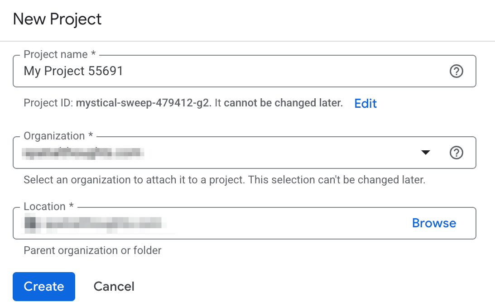
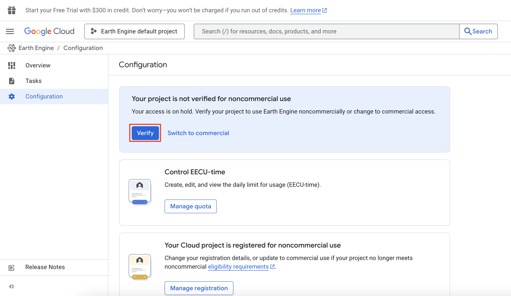
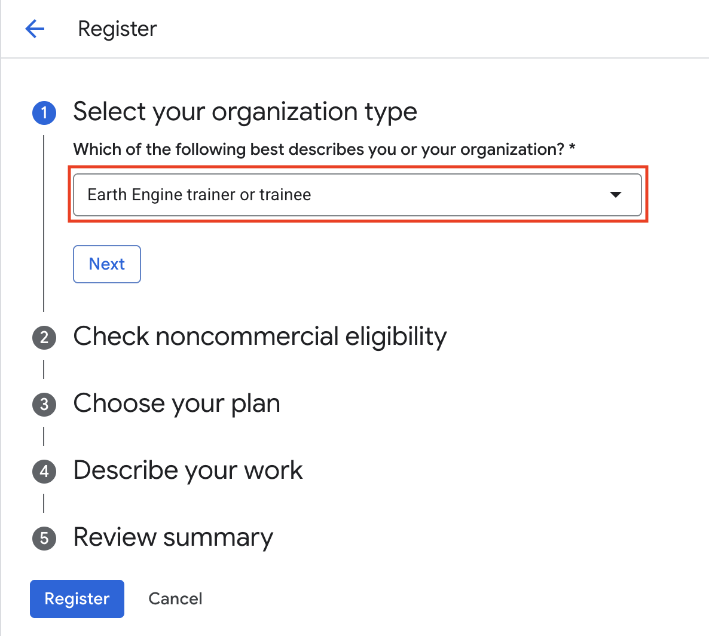
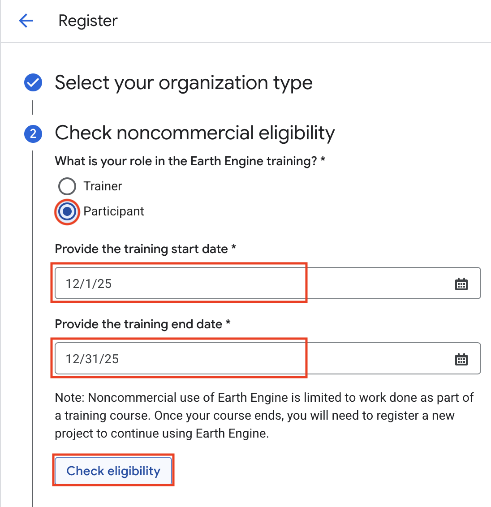
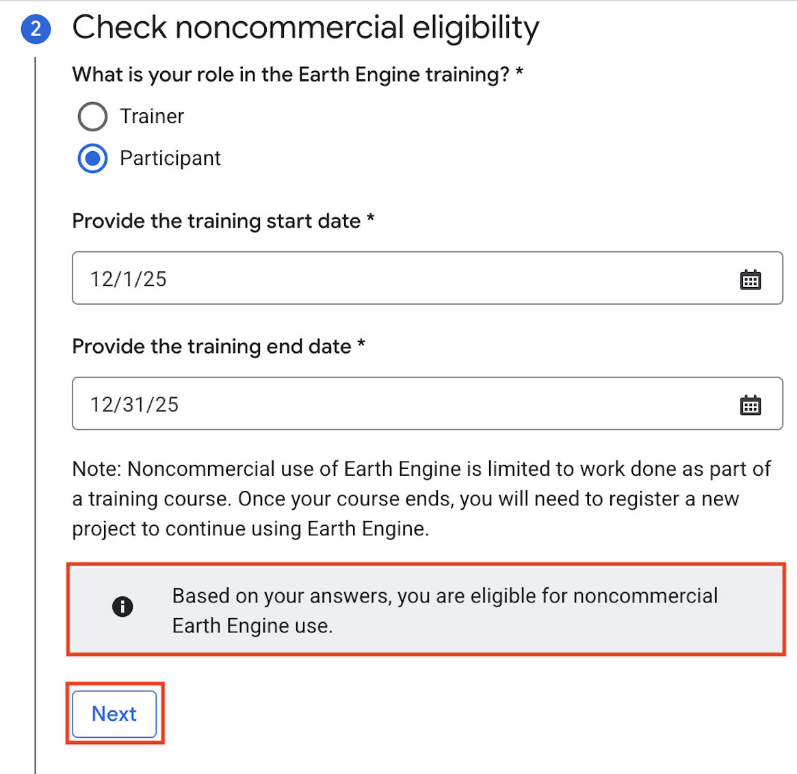
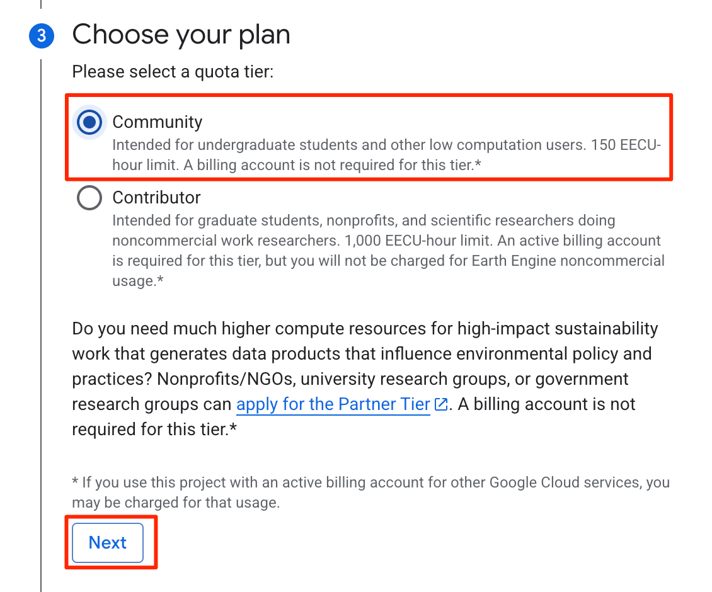
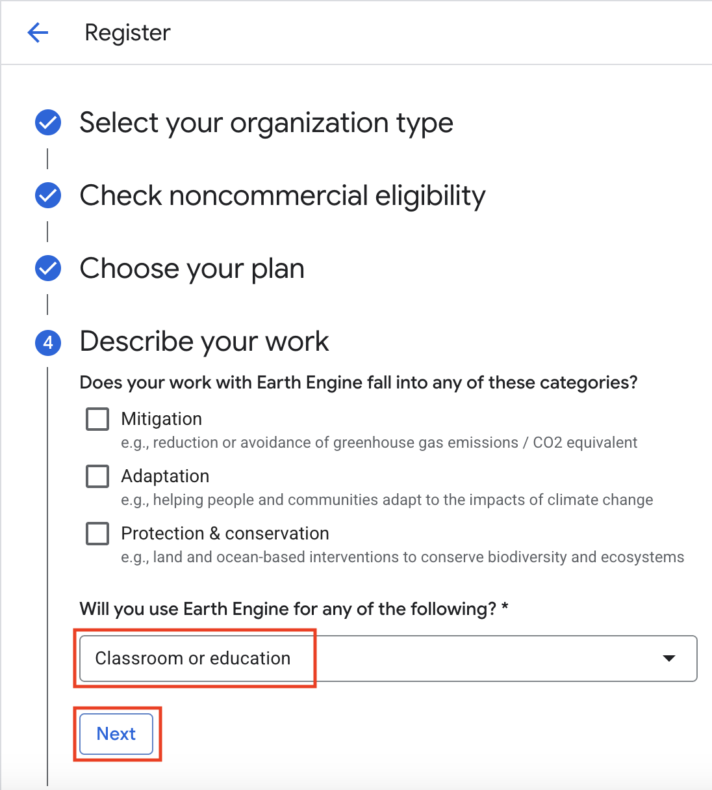
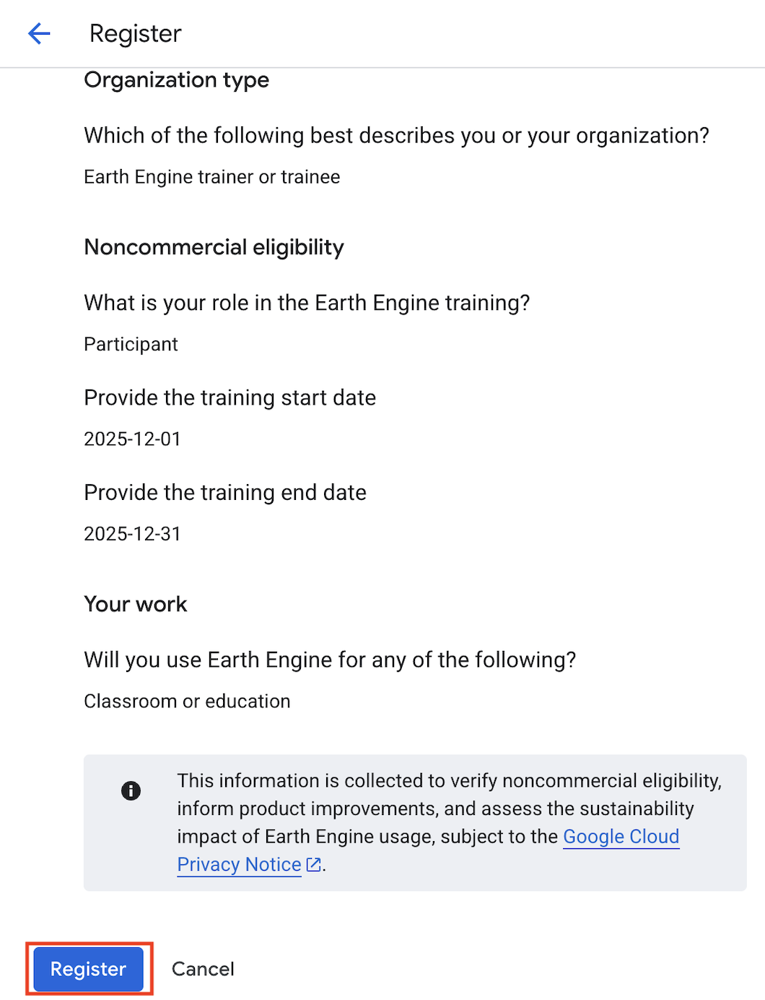
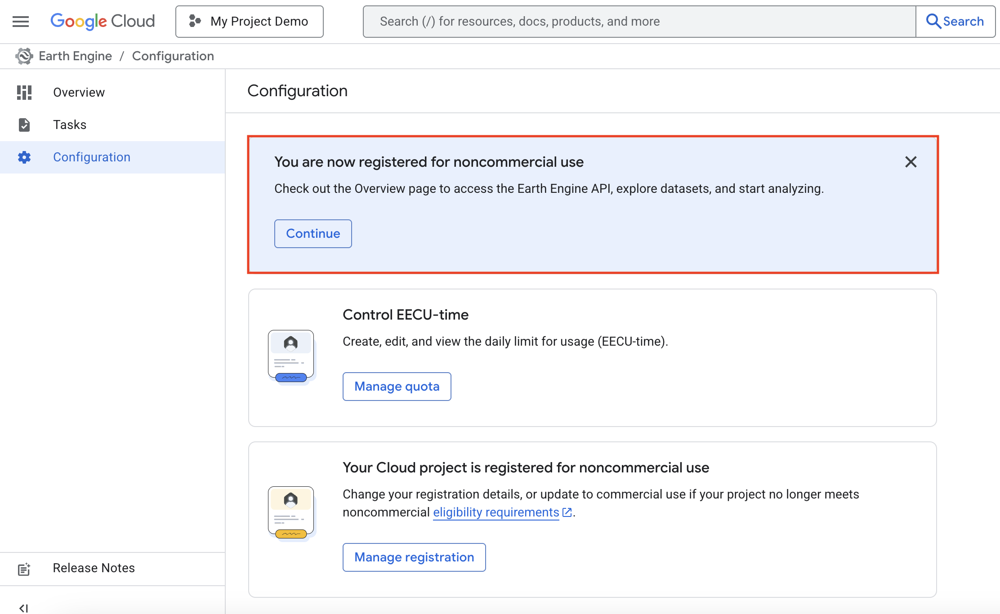
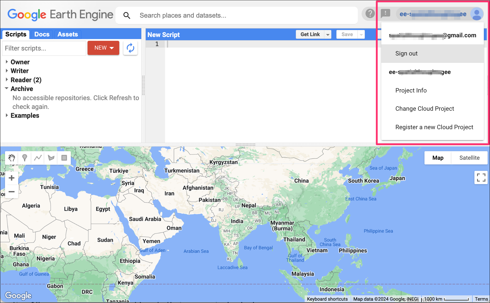

# Exercise 1 — Set Up Your Earth Engine Account

**Goal:** Create a free Google Earth Engine account linked to a Google
Cloud project, registered for **noncommercial** use. By the end you will
be able to open the Code Editor and see your project name in the corner.

> **Why a "Cloud project"?** Since late 2024, Earth Engine runs on Google
> Cloud. Every user now needs a Cloud *project* — think of it as your free
> workspace. Noncommercial and research use stays **free**: you do **not**
> need a credit card or billing account.

**Time:** ~20 minutes · **You need:** a Google (Gmail) account and Chrome.

---

## Step 1 — Sign in with your Google account
1. Open Chrome and go to **[code.earthengine.google.com/register](https://code.earthengine.google.com/register){:target="_blank"}**
2. Sign in with your Google/Gmail account (or create one first at
   [accounts.google.com/signup](https://accounts.google.com/signup){:target="_blank"}).

## Step 2 — Create your Cloud project
On the **Register a project** page:
1. Choose **Create a new Google Cloud Project**.
2. **Project name:** type something you'll recognise, e.g.
   `SPREP GEE Data 2026`.
3. **Organization** and **Location:** choose **No organization**.
4. Click **Continue** / **Create**.

> 💡 **Include your country in the name** — e.g. `Samoa GEE Data 2026`
> helps identify your project later. The name field has a 30-character limit,
> so keep it short.



> A *Project ID* is generated automatically (something like
> `ee-yourname`). Write it down — you'll need it for the Python scripts.

## Step 3 — Verify noncommercial eligibility


You'll be taken to a short configuration questionnaire. Choose the options
that fit a training workshop:
1. **Organization type:** select **Earth Engine trainer or trainee**, then **Next**.


2. **Check noncommercial eligibility:** choose role **Participant** and
   enter the workshop start and end dates. Click **Check eligibility**.


3. You'll see a note confirming you're **eligible for noncommercial Earth
   Engine**. Click **Next**.



## Step 4 — Choose your free plan
1. Under **Choose your plan**, select the **Community** tier
   (free, no billing needed — perfect for learning).


2. **Describe your work:** choose **Classroom or education**. Click **Next**.



## Step 5 — Register
1. Review the summary and click **Register**.


2. When you see the confirmation, click **Continue**.



## Step 6 — Open the Code Editor
1. Go to **[code.earthengine.google.com](https://code.earthengine.google.com){:target="_blank"}**
2. Top-right corner: you should see your project name / ID.



---

## Check — did it work?
✅ The Code Editor loads with four panels (scripts, editor, console, map).
✅ Your project name appears in the **top-right** corner.

If the editor says *"no project"* or asks you to register, click the
**profile circle (top-right) → Register a new Cloud project** and repeat
Steps 2–5.

## Run your first line of code
Paste this into the centre editor panel and click **Run**:

```javascript
print('Talofa! Earth Engine is working.', ee.Number(40).add(2));
```

You should see `Talofa! Earth Engine is working.` and `42` in the
**Console** tab on the right. 🎉

---

> **Remember:** noncommercial projects must **re-verify once a year** to
> keep free access. Earth Engine will email you when it's time.

## Optional — confirm everything works (1 minute)
Paste [`scripts/javascript/99_diagnostic_check.js`](../scripts/diagnostic.md)
into the Code Editor and click **Run**. It prints which Pacific country
names are available and confirms every workshop dataset loads in your
account. (Facilitators: run this before the session.)

**Next:** [Exercise 2 — Code Editor basics & your country](code-editor.md)

---

> 📸 **Screenshot credits:** Sign-up flow screenshots adapted from
> [Spatial Thoughts](https://courses.spatialthoughts.com/gee-sign-up.html){:target="_blank"}
> (Ujaval Gandhi), used with gratitude for the Earth Engine education community.
