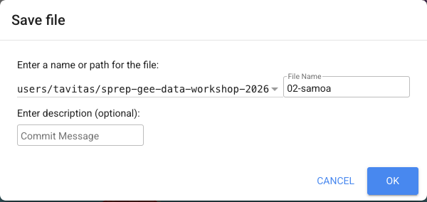

# Exercise 2 — Code Editor Basics & Your Country

**Goal:** Get comfortable with the Earth Engine Code Editor and put **your
own country** on the map. This boundary becomes the "area of interest"
(AOI) you reuse in every later exercise.

**Time:** ~25 minutes · **Before you start:** finish Exercise 1.

---

## The Code Editor at a glance
When you open https://code.earthengine.google.com you see four areas:

- **Left — Scripts:** save and open your code files (your repositories).
- **Centre — Editor:** where you type/paste JavaScript. **Run** is at the top.
- **Right — Console:** where `print()` output and charts appear.
- **Bottom — Map:** where layers you add appear.

There are three tabs top-right: **Inspector** (click the map to read pixel
values), **Console** (text output), and **Tasks** (exports).

## Step 1 — Print a message
Type this and click **Run**:
```javascript
print('My first Earth Engine script');
```
Output appears in the **Console** on the right.

## Step 2 — Load your country's boundary
We use the global **LSIB** boundary dataset. Change `'Samoa'` to your
country. Run it:
```javascript
//    The 14 SPREP member countries (use exact LSIB spelling):
//    High islands -> LSIB outline works well:
//      'Fiji', 'Samoa', 'Vanuatu', 'Papua New Guinea', 'Solomon Is'
//    Small island / atoll nations -> point+buffer is more reliable:
//      'Tonga', 'Kiribati', 'Nauru', 'Tuvalu', 'Palau', 'Marshall Is',
//      'Fed States of Micronesia', 'Cook Is', 'Niue'
//    (LSIB polygons can be imprecise for tiny atolls; see below)
var countryName = 'Samoa';

// 2. Load the global boundaries and keep just your country
var country = ee.FeatureCollection('USDOS/LSIB_SIMPLE/2017')
                .filter(ee.Filter.eq('country_na', countryName));

// 3. Center and zoom the map to fit your country
Map.centerObject(country);

// 4. Draw it
Map.addLayer(country, {color: 'red'}, countryName);
```

The map at the bottom should jump to your country with a red outline.

## Step 3 — Use the Inspector
1. Click the **Inspector** tab (top-right).
2. Click anywhere on your country on the map.
3. Read the feature's properties (area, name, etc.) in the panel.

## Step 4 — Save your script
1. Click **Save** (top of editor).
2. If prompted, create a repository, e.g. `sprep-gee-data-workshop-2026`.
3. Name the file `02-my-country`. It now lives in the **Scripts** panel.



---

## Your turn — and an important gotcha about country names

The boundary layer `USDOS/LSIB_SIMPLE/2017` has **two quirks** you must know:

1. It uses **US State Department spellings**, which are not always the
   plain-English name. For example you must filter on `Solomon Is`, not
   `Solomon Islands`.
2. It uses a **coarse simplification**, so tiny atoll polygons may be
   imprecise — a point + buffer is more reliable for small nations
   (see the next section). All 14 member countries **do** have LSIB entries.

### LSIB country names — use these exact spellings

| Type this `countryName` | Result |
|-------------------------|--------|
| `Fiji` | works |
| `Samoa` | works |
| `Vanuatu` | works |
| `Papua New Guinea` | works |
| `Solomon Is` | works (note: **not** "Solomon Islands") |
| `Tonga` | works |
| `Kiribati` | works |
| `Nauru` | works |
| `Tuvalu` | works |
| `Palau` | works |
| `Marshall Is` | works |
| `Fed States of Micronesia` | works |
| `Cook Is` | works |
| `Niue` | works |
### Small islands and atolls — point + buffer recommended

All 14 member countries are present in LSIB. However, LSIB polygons for small
island and atoll nations can be imprecise — the coarse (11–28 km) climate
grids may miss tiny land areas. A point + buffer is more reliable for
these: Tonga, Palau, Tuvalu, Kiribati, Nauru, Niue, Cook Islands,
Marshall Islands and Federated States of Micronesia.
**Any of the 14 member countries** can use this approach.
Define your area as a **point with a circle (buffer)**:
```javascript
// Funafuti, Tuvalu + 350 km of surrounding ocean/atolls
var country = ee.Geometry.Point([178.5, -7.8]).buffer(350000);
Map.centerObject(country, 7);
Map.addLayer(country, {color: 'red'}, 'Tuvalu (point + buffer)');
```

### The easy way — let the helper handle both

The climate scripts in [`../scripts`](../scripts/index.md) and the helper file
[`../scripts/javascript.md`](../scripts/javascript.md)
do this for you: you type the **friendly name** (e.g. `Solomon Islands` or
`Tuvalu`) and `getCountry('Solomon Islands')` returns the right area
automatically. Run **`99_diagnostic_check.js`** once to see live which
names resolve in your account.

---

## Check — did it work?
✅ The map centres on your country.
✅ A red boundary (or circle) is drawn.
✅ Clicking with the Inspector shows properties.
✅ Your script is saved in the Scripts panel.

**Next:** [Exercise 3 — Rainfall & drought](rainfall.md)
